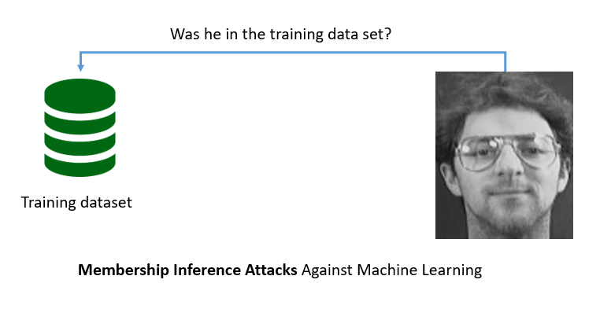

## Motivation
Machine Learning(ML) models can memorize training datasets.Training ML models over private datasets can violate the privacy of individuals.
For Example, there are two types of attacks that can extract training data from a ML model:

* Model Inversion Attacks
* Membership Inference Attacks

   

