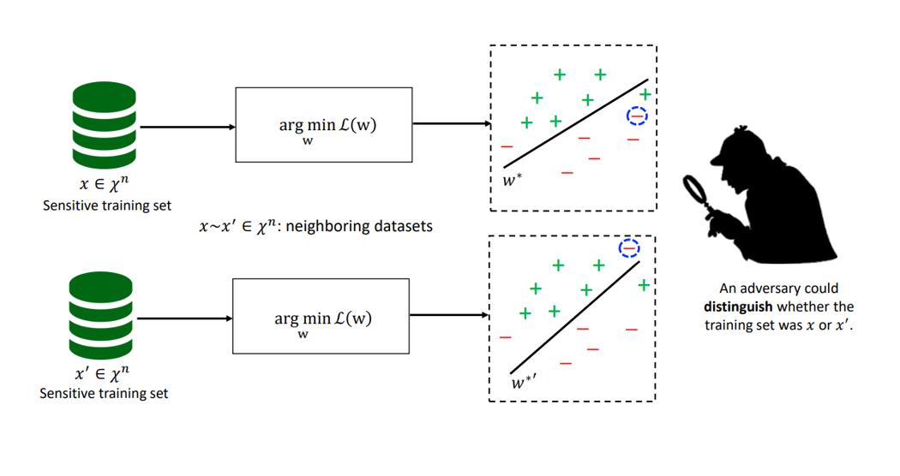

## Motivation
Machine Learning(ML) models can memorize training datasets. So, training ML models over private datasets can violate the privacy of individuals.
For Example, Model Inversion Attacks can extract training data from a ML model.

In model inversion attacks, an adversary attempts to recover the private dataset used to train a ML model.

## What I did in this project?
I developed a differentially private classifier based on logistic regression. The hypothetical training dataset contains two medical features of 100 individuals. And labels classify individuals to high risk and low risk of developing a disease. My goal is to make the logistic regression algorithm, differentially private.

## Non - Private Logistic Regression
The decision boundary of the classifier is sensitive to the individual data points in the training set.

## Private Logistic Regression
We apply Gaussian mechanism for privatizing the updating rule of the gradient descent

We make every iteration of gradient descent algorithm differentially private by implementing the noisy gradient descent algorithm.
