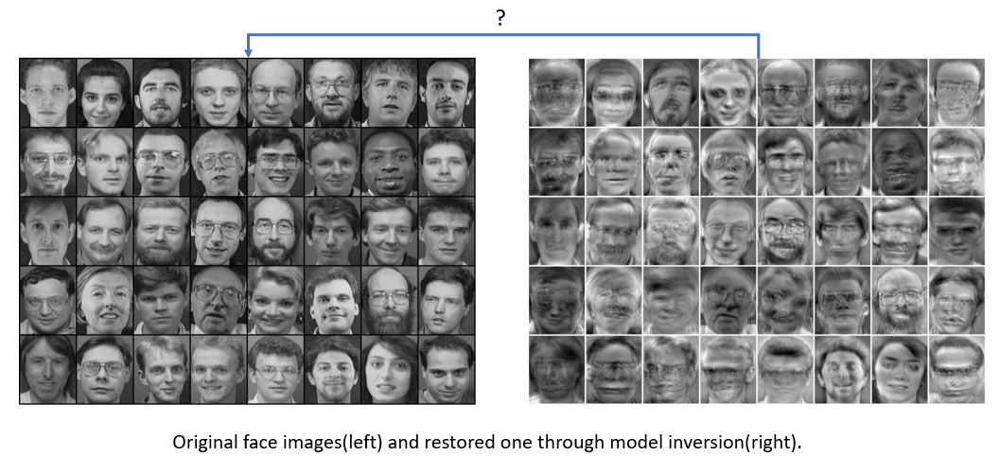
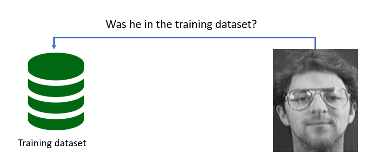
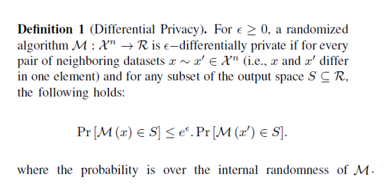
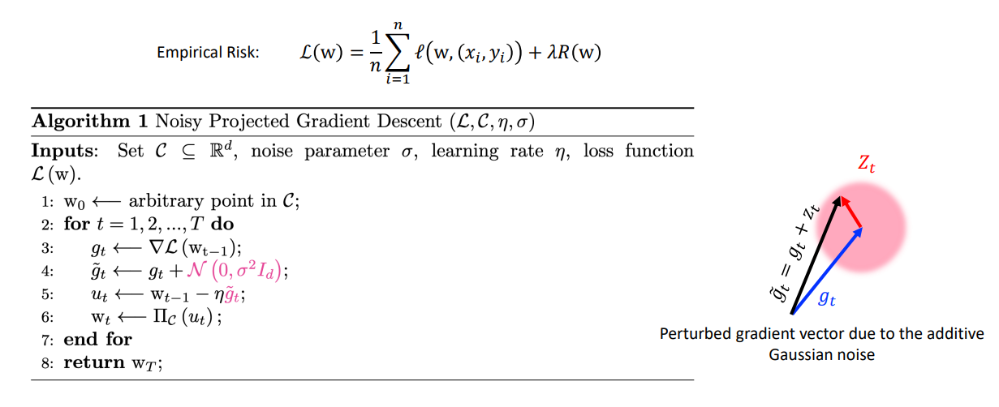

# Motivation

### Privacy Issues in Machine Learning

Imagine, you would like to train a classifier. Usually, you start with some (potentially sensible) training data, i.e. some data features X  and corresponding class y labels. You pick an algorithm, e.g. a logistic regression, and then you use your training data to make the model learn to map from X to y. This mapping should generalize well, such that your model is also able to predict the correct labels for, so far, unseen data X′.

What is less frequently addressed is the fact that the process of turning training data into a good model is not necessarily a one-way street. In order to learn a mapping from specific features to corresponding labels, the model needs to “remember” in its parameters some information about the data it was trained on. how would it come to correct conclusions about new and unseen data?

The fact that some information about the training data is stored in the model parameters, might, however, cause privacy problems. This is because it enables someone with access to the ML model to deduct different kinds of information about the training data. 

### Model Inversion Attack

A very popular attack is the so-called model inversion attack that was first proposed by Matt Fredrikson in 2015. The attack uses a trained classifier in order to extract representations of the training data.

### Membership Inference Attacks

Membership inference attacks were first described by Reza Shokri in 2017.

The concept of membership inference attacks: Given a trained ML model, try to identify which data points were included in the training set an which ones weren't. You might not see the privacy risk right away, but think of the following situation:

Imagine you are in a clinical context. There, you may have an ML model that is supposed to predict an adequate medical treatment for cancer patients. This model, naturally, needs to be trained on the data of cancer patients. Hence, given a data point, if you are able to determine that it was indeed part of the model’s training data, you will know that the corresponding patient must have cancer. As a consequence, this patient’s privacy would be disclosed.

 

 

 

  

  

# What I did in this project?
I developed a differentially private classifier based on logistic regression. The hypothetical training dataset contains two medical features of 100 individuals. And labels classify individuals to high risk and low risk of developing a disease. My goal is to make the logistic regression algorithm, differentially private.

## What is Differential Privacy?
Differential Privacy(DP) is a formal mathematical standard for protecting individuals privacy. DP ensures that the output of a computation will be roughly unchanged whether or not an individual’s data is used, thus limiting an adversary’s ability to infer about individuals’ data points. The main idea for satisfying this condition is to perturb the computation by injecting a calibrated amount of noise to mask the contribution of each individual in the dataset. In the following, I present the
formal definition of DP and a couple of remarks about this notion.

The aforementioned definition is about the behavior of M and promises that no individual’s data has a large impact on the output. More formally, when an ϵ−differentially private algorithm runs on two neighboring datasets, the resulting distributions over the output space will be very similar,and this similarity is captured by a multiplicative factor e^ϵ. The required noise for satisfying DP is calibrated based on the global sensitivity of the computation. I formalize the mathematical definition of the global sensitivity in the following.

Perturbation techniques for satisfying DP in a computation are classified into two basic categories:
1) adding calibrated random noise to the input data
2) adding calibrated random noise to the outputs

Nevertheless, adding noise to the input or output of this problem may lead to inaccurate results. To address this problem, I use noisy gradient descent algorithm that I explain about it in the next part.

 

# Private Logistic Regression
I apply Gaussian mechanism for privatizing the updating rule of the gradient descent

Every iteration of gradient descent is differentially private by adding callibrated Gaussian noise to the gradient computation in each iteration.

# Results

In this section we investigate the intrinsic trade-off between accuracy and privacy in an differentially private logistic regression. Also now we can quantize the level of privacy in our ML model.

We control the level of privacy with parameter epsilon.
